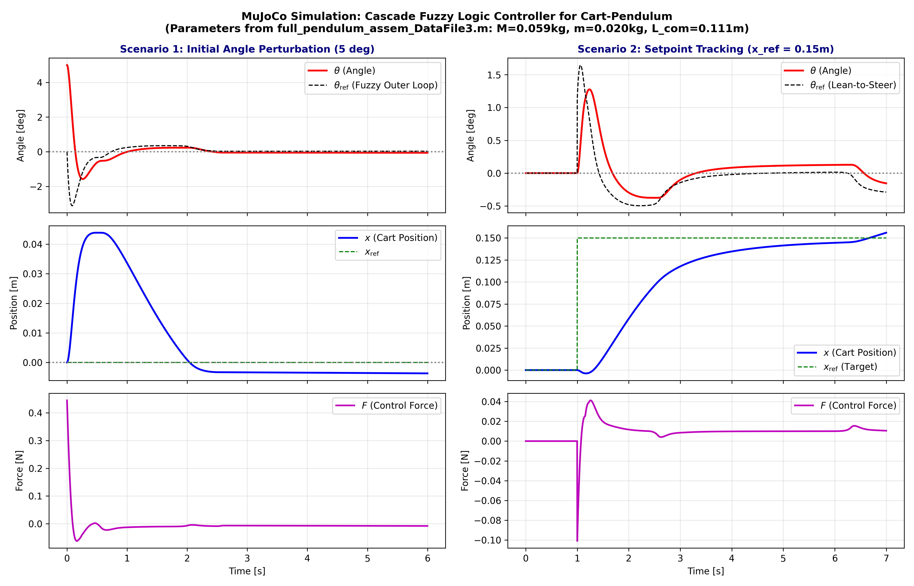

# Cascade Fuzzy Controller for Inverted Cart-Pendulum (MuJoCo & Simulink)

This repository contains the physical modeling, design, tuning, and simulation of a **Cascade Fuzzy Logic Controller (Dual-Loop Fuzzy)** for an underactuated **Inverted Pendulum on a Cart (Cart-Pole)** system, simulated in **MuJoCo** and compatible with **MATLAB/Simulink**.

The model parameters are matched exactly to the real tabletop experimental setup exported from SolidWorks / Simscape Multibody (`full_pendulum_assem_DataFile3.m`).



---

## 1. Physical Parameters (HUST SolidWorks Model)

Extracted from CAD assembly `full_pendulum_assem.SLDASM`:

| Component | Parameter | Notation | Value | Unit |
| :--- | :--- | :---: | :---: | :---: |
| **Cart** | Mass | $M$ | `0.05912` | $\text{kg}$ ($59.1\text{ g}$) |
| | Inertia ($I_{xx}, I_{yy}, I_{zz}$) | $I_c$ | `[2.20e-5, 5.85e-5, 6.51e-5]` | $\text{kg}\cdot\text{m}^2$ |
| | Travel stroke limit | $x_{\max}$ | `[-0.40, +0.40]` | $\text{m}$ |
| **Pole** | Mass | $m$ | `0.01963` | $\text{kg}$ ($19.6\text{ g}$) |
| | Hinge to Center of Mass | $l_{\text{com}}$ | `0.11063` | $\text{m}$ |
| | Moment of inertia about CoM | $I_p$ | `1.9733e-4` | $\text{kg}\cdot\text{m}^2$ |
| **Coupling** | Total system mass | $M_t$ | `0.07875` | $\text{kg}$ ($78.8\text{ g}$) |
| | Actuator force limit | $F_{\max}$ | `[-3.0, +3.0]` | $\text{N}$ |

---

## 2. Control Architecture: Cascade-Fuzzy (Lean-to-Steer)

Single-loop controllers only stabilize the angle $\theta \to 0$, leading to persistent **Cart Drift** along the rail. To eliminate drift without unstable force conflicts, the **Cascade-Fuzzy** architecture separates time scales:

```
x_ref ──(+)──> [ Outer Fuzzy: Position ] ──> θ_ref ──(+)──> [ Inner Fuzzy: Angle ] ──> Force F ──> [ MuJoCo Plant ]
         │      (Inputs: e_x, de_x)                     │      (Inputs: e_θ, de_θ)                   │
         └──( - )───────────────────────────────────────┴──( - )─────────────────────────────────────┘
```

1. **Outer Loop (Position Loop - Slow Dynamics):**
   - **Inputs:** Position error $e_x = x_{\text{ref}} - x$, velocity $\dot{x}$.
   - **Output:** Reference lean angle $\theta_{\text{ref}}$ (limited to $\pm 4.6^\circ$).
   - **Physics ("Lean-to-Steer"):** To move the cart left, the controller commands the pole to lean slightly left ($\theta_{\text{ref}} < 0$).
2. **Inner Loop (Angle Loop - Fast Dynamics):**
   - **Inputs:** Angle error $e_{\theta} = \theta - \theta_{\text{ref}}$, angular velocity $\dot{\theta}$.
   - **Output:** Actuator force $F$ applied to the cart ($[-3.0\text{ N}, +3.0\text{ N}]$).
   - **Physics:** Rapid balance reflex that keeps the pole upright and pushes the cart toward the target.

### Fuzzy Inference System (5x5 MacVicar-Whelan Rules)
Both loops utilize 5 triangular/trapezoidal membership functions: **NB** (Negative Big), **NS** (Negative Small), **ZE** (Zero), **PS** (Positive Small), **PB** (Positive Big).

```
       de:   NB   NS   ZE   PS   PB
e:
NB           NB   NB   NB   NS   ZE
NS           NB   NB   NS   ZE   PS
ZE           NB   NS   ZE   PS   PB
PS           NS   ZE   PS   PB   PB
PB           ZE   PS   PB   PB   PB
```

---

## 3. Tuned Parameters

- **Inner Angle Loop:**
  - $K_{e,\theta} = 6.0$
  - $K_{d,\theta} = 0.65$
  - $K_u = 0.85\text{ N}$
- **Outer Position Loop:**
  - $K_{e,x} = 2.2$
  - $K_{d,x} = 4.0$
  - $K_{\theta,\text{ref}} = 0.06\text{ rad}$

---

## 4. File Structure

```
.
├── cart_pendulum_hust.xml         # MuJoCo MJCF physics model (exact HUST parameters)
├── fuzzy_controller.py            # Vectorized Fuzzy PD & Cascade-Fuzzy module (NumPy)
├── run_simulation_plot.py         # Simulation runner & matplotlib plot generator
├── run_mujoco_viewer.py           # Real-time interactive 3D simulation with MuJoCo viewer
├── tune_fuzzy.py                  # Auto-tuning optimizer for fuzzy scaling gains
├── simulate_test.py               # Unit test script for controller verification
├── build_cascade_fuzzy_mats.m     # MATLAB script to generate .fis files for Simulink
├── full_pendulum_assem_DataFile3.m# SolidWorks/Simscape exported physical data
└── fuzzy_mujoco_response.png      # Response plot (perturbation & step tracking)
```

---

## 5. Getting Started

### Prerequisites
- Python 3.8+
- `mujoco` (`pip install mujoco`)
- `numpy`, `matplotlib`, `scipy`

### 1. Run Interactive 3D Simulation
Launch the real-time MuJoCo 3D simulation:
```bash
python run_mujoco_viewer.py
```
- **Interact:** Right-click and drag on the cart or pole in the 3D window to push it and watch the fuzzy controller recover in real-time.
- **Pause:** Press `Space`.
- **Reset:** Press `Backspace`.

### 2. Generate Performance Curves
```bash
python run_simulation_plot.py
```
This runs Scenario 1 (5° angle perturbation rejection) and Scenario 2 (step response to $x_{\text{ref}} = 0.15\text{ m}$) and saves `fuzzy_mujoco_response.png`.

### 3. Simulink / MATLAB Integration
Open MATLAB and run:
```matlab
build_cascade_fuzzy_mats
```
This generates `cartpole_inner_angle.fis` and `cartpole_outer_pos.fis` ready to be plugged into the Fuzzy Logic Controller blocks in Simulink.
