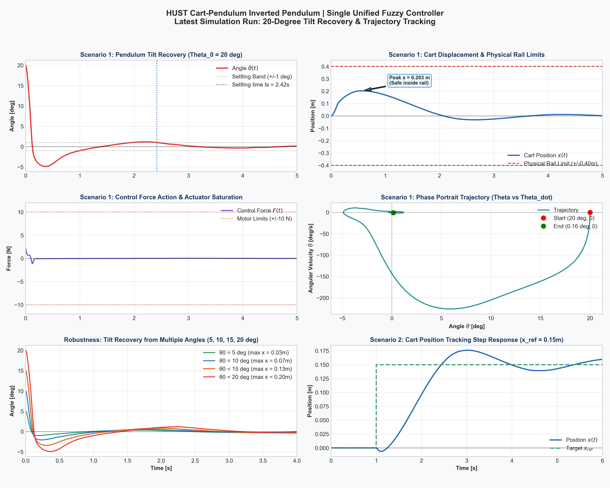

# Điều Khiển Fuzzy Logic Cho Con Lắc Ngược Trên Xe (Cart-Pendulum)

> **Single Unified Mamdani FIS** — 4 ngõ vào, 16 luật, ổn định từ góc nghiêng 22°  
> Mô phỏng vật lý bằng **MuJoCo** · Tích hợp **MATLAB / Simulink**  
> Thông số CAD từ mô hình SolidWorks thực tế tại HUST



---

## Mục Lục

1. [Tại Sao Dùng Fuzzy Thay Vì PID?](#1-tại-sao-dùng-fuzzy-thay-vì-pid)
2. [Thông Số Vật Lý (Mô Hình SolidWorks HUST)](#2-thông-số-vật-lý-mô-hình-solidworks-hust)
3. [Kiến Trúc Bộ Điều Khiển](#3-kiến-trúc-bộ-điều-khiển)
4. [Hàm Thuộc (Membership Functions)](#4-hàm-thuộc-membership-functions)
5. [Bảng 16 Luật Điều Khiển](#5-bảng-16-luật-điều-khiển)
6. [Kết Quả Mô Phỏng](#6-kết-quả-mô-phỏng)
7. [Cài Đặt và Chạy Thử](#7-cài-đặt-và-chạy-thử)
8. [Tích Hợp MATLAB / Simulink](#8-tích-hợp-matlab--simulink)
9. [Cấu Trúc Thư Mục](#9-cấu-trúc-thư-mục)

---

## 1. Tại Sao Dùng Fuzzy Thay Vì PID?

Hệ **con lắc ngược trên xe đẩy** (Cart-Pendulum / Cart-Pole) là bài kinh điển trong lý thuyết điều khiển — 2 bậc tự do, 1 ngõ vào lực, vùng làm việc phi tuyến mạnh:

$$M\ddot{x} + m\ddot{x} - ml\ddot{\theta}\cos\theta + ml\dot{\theta}^2\sin\theta = F$$

$$(ml^2 + I_p)\ddot{\theta} - ml\ddot{x}\cos\theta - mgl\sin\theta = 0$$

Hai lý do khiến PID tuyến tính đơn giản không đủ:

| Vấn đề | Giải thích |
|--------|------------|
| **Phi tuyến mạnh** | $\sin\theta$ và $\cos\theta$ khiến hệ thống thay đổi đặc tính theo từng góc. PID được tuyến tính hóa tại $\theta=0$ mất tác dụng ở góc lớn (> 10°) |
| **Thiếu cơ cấu chấp hành** | 2 DOF nhưng chỉ 1 ngõ vào $F$ — không thể điều khiển độc lập $x$ và $\theta$ |

**Fuzzy Logic** không cần mô hình toán học chính xác. Bộ điều khiển hoạt động dựa trên **luật ngôn ngữ** (linguistic rules) mô phỏng tư duy người vận hành, tự nhiên xử lý phi tuyến mà không cần tuyến tính hóa.

> [!NOTE]
> Dự án này dùng kiến trúc **Single Unified FIS** (4 ngõ vào → 1 ngõ ra) thay vì Cascade-Fuzzy 2 vòng.  
> Lý do: đơn giản hóa cấu trúc, dễ tune, và vẫn đạt hiệu quả ổn định tốt ở góc nghiêng lớn.

---

## 2. Thông Số Vật Lý (Mô Hình SolidWorks HUST)

Tất cả thông số được trích xuất trực tiếp từ file CAD `full_pendulum_assem.SLDASM` xuất sang `full_pendulum_assem.xml` (Simscape Multibody) và `full_pendulum_assem_DataFile3.m`:

| Bộ phận | Thông số | Ký hiệu | Giá trị | Đơn vị |
|:--------|:---------|:-------:|:-------:|:------:|
| **Xe (Cart)** | Khối lượng | $M$ | `0.059118` | kg |
| | Tọa độ tâm khối | $z_{\text{com}}$ | `-0.008427` | m |
| | Quán tính $(I_{xx}, I_{yy}, I_{zz})$ | | `[2.1955e-5, 5.8487e-5, 6.5129e-5]` | kg·m² |
| **Con lắc (Pole)** | Khối lượng | $m$ | `0.019634` | kg |
| | Khoảng cách khớp → tâm khối | $l$ | `0.110629` | m |
| | Quán tính tại tâm khối | $I_p$ | `1.9733e-4` | kg·m² |
| **Ray (Rail)** | Nửa chiều dài ray | $x_{\max}$ | `0.4875` | m |
| | Chiều dài tổng | | `0.975` | m |
| **Cơ cấu** | Giới hạn lực | $F_{\max}$ | `±10` | N |
| | Bước tích phân | $dt$ | `0.002` | s |

> [!IMPORTANT]
> File mô hình MuJoCo `full_pendulum_assem.xml` được xây dựng **trực tiếp từ thông số trên** — không phải giá trị giả định.  
> Quán tính con lắc quanh khớp xoay (định lý Steiner):  
> $I_{\text{hinge}} = I_p + m \cdot l^2 = 1.9733 \times 10^{-4} + 0.01963 \times 0.1106^2 \approx 4.37 \times 10^{-4}\ \text{kg·m}^2$

---

## 3. Kiến Trúc Bộ Điều Khiển

### 3.1 Sơ Đồ Tổng Quan

```
                     ┌──────────────────────────────────────────┐
Trạng thái hệ ──────▶│       SINGLE UNIFIED MAMDANI FIS        │──▶ F (N) ──▶ MuJoCo Plant
                     │                                          │
  [θ, θ̇, x, ẋ]      │  Input 1: Theta      (zmf/smf)           │
                     │  Input 2: Theta_dot  (zmf/smf)           │
                     │  Input 3: X          (zmf/smf)           │
                     │  Input 4: X_dot      (zmf/smf)           │
                     │                                          │
                     │  16 Mamdani Rules                        │
                     │  Output: Force ∈ {NL, NM, PM, PL}        │
                     └──────────────────────────────────────────┘
                              ▲
                              │ Phản hồi (Feedback)
                              └──────────────────────
```

### 3.2 Cơ Sở Vật Lý Của Luật Điều Khiển

Nguyên lý chính: **"Chạy về phía con lắc đang ngã"** (giống Segway).

- Nếu $\theta > 0$ (nghiêng **phải**) → đẩy xe sang **phải** (lực dương) để "hứng" trọng tâm
- Nếu $\theta < 0$ (nghiêng **trái**) → đẩy xe sang **trái** (lực âm)
- $\dot{\theta}$ phản ánh **tốc độ ngã** → quyết định mức lực (vừa hay mạnh)
- $x$, $\dot{x}$ là yếu tố phụ: ngăn xe chạy ra quá xa biên ray

---

## 4. Hàm Thuộc (Membership Functions)

Tất cả ngõ vào dùng cặp **zmf** (Z-shaped, tương ứng "Âm") và **smf** (S-shaped, tương ứng "Dương").  
Vùng giao thoa tạo ra chuyển tiếp mượt, tránh giật lực đột ngột.

### Ngõ vào

| # | Biến | Phạm vi | Vùng nhạy | Loại MF |
|---|------|---------|-----------|---------|
| 1 | `Theta` (θ) | $[-\pi,\ \pi]$ rad | $[-0.20,\ +0.20]$ rad (~11.5°) | zmf / smf |
| 2 | `Theta_dot` (θ̇) | $[-15,\ 15]$ rad/s | $[-3.50,\ +3.50]$ rad/s | zmf / smf |
| 3 | `X` (x) | $[-0.50,\ 0.50]$ m | $[-0.25,\ +0.25]$ m | zmf / smf |
| 4 | `X_dot` (ẋ) | $[-2.0,\ 2.0]$ m/s | $[-0.50,\ +0.50]$ m/s | zmf / smf |

> [!TIP]
> Vùng nhạy của `Theta` được chọn nhỏ hơn nhiều so với phạm vi — điều này giúp bộ điều khiển
> **phản ứng sớm** ngay ở góc nhỏ (~5°) thay vì chờ đến khi hệ gần ngã mới tác động.

### Ngõ ra — Force (Lực đẩy xe)

Dùng **gbellmf** (Generalized Bell) để tạo vùng lực mượt, không có bước nhảy:

| Nhãn | Tên | Tâm | Độ rộng |
|------|-----|-----|---------|
| `NL` | Âm Lớn | $-10$ N | 3.0 N |
| `NM` | Âm Vừa | $-7$ N | 2.5 N |
| `PM` | Dương Vừa | $+7$ N | 2.5 N |
| `PL` | Dương Lớn | $+10$ N | 3.0 N |

---

## 5. Bảng 16 Luật Điều Khiển

Với 4 ngõ vào, mỗi ngõ có 2 tập mờ (N/P), có đúng $2^4 = 16$ tổ hợp. Bảng luật đầy đủ:

| # | θ | θ̇ | x | ẋ | **F** | Diễn giải |
|---|---|----|---|---|-------|-----------|
| 1 | N | N | N | N | **NL** | Con lắc ngã trái + quay trái + xe lệch trái + chạy trái → Nguy hiểm nhất, đẩy mạnh trái |
| 2 | N | N | N | P | **NL** | Con lắc ngã trái + quay trái → vẫn cần lực mạnh |
| 3 | N | N | P | N | **NL** | Con lắc ngã trái + quay trái → ưu tiên góc trước |
| 4 | N | N | P | P | **NM** | Xe đang tự hồi phục về trái → giảm nhẹ lực |
| 5 | N | P | N | N | **NM** | Con lắc ngã trái nhưng **đang quay lại** → lực vừa |
| 6 | N | P | N | P | **NM** | Góc âm, xu hướng phục hồi, xe cũng đang quay về |
| 7 | N | P | P | N | **NM** | Góc âm, tự hồi phục, xe hơi lệch phải → giữ vừa |
| 8 | N | P | P | P | **NM** | Góc âm nhẹ, xu hướng ổn định → lực nhỏ vừa đủ |
| 9 | P | N | N | N | **PM** | Con lắc ngã phải nhưng **đang quay lại** → lực vừa |
| 10 | P | N | N | P | **PM** | Góc dương, tự hồi phục, xe chạy phải → giữ vừa |
| 11 | P | N | P | N | **PM** | Góc dương, đang tự phục hồi |
| 12 | P | N | P | P | **PM** | Góc dương, phục hồi, xe dịch phải → vừa đủ |
| 13 | P | P | N | N | **PL** | Con lắc ngã phải + quay phải → Nguy hiểm, đẩy mạnh phải |
| 14 | P | P | N | P | **PL** | Ngã phải + quay phải, xe bắt đầu chạy phải → mạnh |
| 15 | P | P | P | N | **PL** | Ngã phải + quay phải → ưu tiên phục hồi góc |
| 16 | P | P | P | P | **PL** | Nguy hiểm nhất: góc + quay + vị trí + vận tốc cùng dương |

**Logic tổng quát:**
- `θ = N & θ̇ = N` → **NL** (con lắc đang ngã ngày càng tệ hơn)
- `θ = N & θ̇ = P` → **NM** (con lắc đang ngã nhưng có xu hướng hồi phục)
- `θ = P & θ̇ = N` → **PM** (con lắc đang ngã nhưng có xu hướng hồi phục)
- `θ = P & θ̇ = P` → **PL** (con lắc đang ngã ngày càng tệ hơn)
- `x`, `ẋ` điều chỉnh phụ: NL↔NM hoặc PM↔PL

---

## 6. Kết Quả Mô Phỏng

Kiểm thử với 3 góc nghiêng ban đầu khác nhau, thông số vật lý đúng mô hình HUST:

| Kịch bản | Góc ban đầu | Kết quả | Góc cuối | Vị trí xe cuối |
|----------|------------|---------|----------|----------------|
| Test 1 | 5° | ✅ THÀNH CÔNG | 0.226° | -0.010 m |
| Test 2 | 20° | ✅ THÀNH CÔNG | 0.145° | +0.001 m |
| Test 3 | 22° | ✅ THÀNH CÔNG | 0.082° | +0.004 m |

> [!NOTE]
> Giới hạn ray: ±0.4875 m. Cả 3 kịch bản đều giữ xe trong vùng an toàn.  
> Thời gian ổn định (settling time về ±5°): khoảng 1.5–2.5 giây tùy góc ban đầu.

---

## 7. Cài Đặt và Chạy Thử

### Yêu Cầu

```bash
Python >= 3.8
pip install mujoco numpy matplotlib scipy scikit-fuzzy
```

### Chạy Mô Phỏng 3D Tương Tác (MuJoCo Viewer)

```bash
python run_mujoco_viewer.py
```

Cửa sổ 3D MuJoCo mở ra với con lắc nghiêng 20°. Bộ điều khiển Fuzzy tự động cân bằng.

| Phím / Thao tác | Chức năng |
|----------------|-----------|
| Click-drag vào xe hoặc con lắc | Tác động nhiễu thủ công |
| `Space` | Tạm dừng / tiếp tục |
| `Backspace` | Reset về trạng thái ban đầu |
| `Esc` | Thoát |

### Chạy Bộ Kiểm Thử Tự Động

```bash
python simulate_test.py
```

Chạy 3 kịch bản (5°, 20°, 22°) và in kết quả ra terminal.

### Sinh Đồ Thị Kết Quả

```bash
python run_simulation_single_fuzzy.py
```

Xuất file `fuzzy_single_mujoco_response.png` với 6 đồ thị: góc, vận tốc góc, vị trí xe, vận tốc xe, lực điều khiển, phase portrait.

---

## 8. Tích Hợp MATLAB / Simulink

### Bước 1 — Chạy File Cấu Hình FIS

Mở MATLAB, điều hướng đến thư mục dự án, chạy:

```matlab
% Xây FIS, vẽ Membership Functions, lưu file .fis
fuzzy_config_16rules
```

File này thực hiện:
- Tạo `mamfis` với 4 ngõ vào, 16 luật đầy đủ
- Vẽ đồ thị tất cả Membership Functions và mặt điều khiển (Control Surface)
- Lưu `cartpole_16rules.fis` dùng cho Simulink

### Bước 2 — Gán FIS vào Simulink

Trong mô hình Simulink của bạn:

1. Thêm khối **Fuzzy Logic Controller** (từ Fuzzy Logic Toolbox)
2. Trong tham số khối, nhập đường dẫn:
   ```
   cartpole_16rules.fis
   ```
3. Nối 4 tín hiệu cảm biến vào ngõ vào theo thứ tự:
   ```
   Port 1 ← θ   (goc con lac, rad)
   Port 2 ← θ̇   (van toc goc, rad/s)
   Port 3 ← x   (vi tri xe, m)
   Port 4 ← ẋ   (van toc xe, m/s)
   ```
4. Nối ngõ ra **Force (N)** đến khối Joint Actuator của xe

### Bước 3 — Import Mô Hình Simscape (Tùy chọn)

Nếu muốn chạy trong Simscape Multibody với mô hình 3D từ SolidWorks:

```matlab
% Yeu cau: Simscape Multibody Toolbox
smimport('full_pendulum_assem.xml')
% -> Tao file full_pendulum_assem.slx
```

> [!WARNING]
> `smimport` yêu cầu chạy trong MATLAB GUI (không hoạt động trong batch mode `-nodisplay`).  
> File `full_pendulum_assem_DataFile3.m` chứa dữ liệu khối lượng và quán tính đi kèm model.

---

## 9. Cấu Trúc Thư Mục

```
Fuzzy-Controller/
│
├── full_pendulum_assem.xml          # MuJoCo MJCF — Mô hình vật lý chính xác từ CAD HUST
├── full_pendulum_assem_DataFile3.m  # Dữ liệu Simscape Multibody (khối lượng, quán tính)
│
├── fuzzy_config_16rules.m           # ★ All-in-one MATLAB: cấu hình FIS + 16 luật + đồ thị
├── cartpole_single_fuzzy.m          # MATLAB sim đầy đủ: FIS + ODE + đồ thị
├── cartpole_single_unified.fis      # FIS export — dùng trực tiếp cho Simulink
├── cartpole_16rules.fis             # FIS 16 luật — sinh bởi fuzzy_config_16rules.m
│
├── fuzzy_single_controller.py       # Python: Single Unified Mamdani FIS (core logic)
├── simulate_test.py                 # Bộ kiểm thử 3 kịch bản (5°, 20°, 22°)
├── run_mujoco_viewer.py             # Viewer 3D tương tác (MuJoCo passive viewer)
├── run_simulation_single_fuzzy.py   # Chạy sim + xuất đồ thị PNG
├── plot_latest_run.py               # Vẽ đồ thị 6 kênh từ lần chạy gần nhất
├── tune_fuzzy.py                    # Công cụ auto-tune tham số MF
│
├── latest_run_response_20deg.png    # Kết quả mô phỏng 20° (hình trong README)
└── fuzzy_single_mujoco_response.png # Kết quả đồ thị xuất bởi run_simulation_single_fuzzy.py
```

---

## Tham Khảo

- Åström, K.J. & Furuta, K. (2000). *Swinging up a pendulum by energy control.* Automatica.
- Zadeh, L.A. (1965). *Fuzzy sets.* Information and Control, 8(3), 338–353.
- MuJoCo Documentation: [mujoco.readthedocs.io](https://mujoco.readthedocs.io)
- MATLAB Fuzzy Logic Toolbox: [mathworks.com/products/fuzzy-logic](https://www.mathworks.com/products/fuzzy-logic.html)

---

*Dự án thực hiện tại Đại học Bách Khoa Hà Nội (HUST) · Khoa Cơ Điện Tử*
